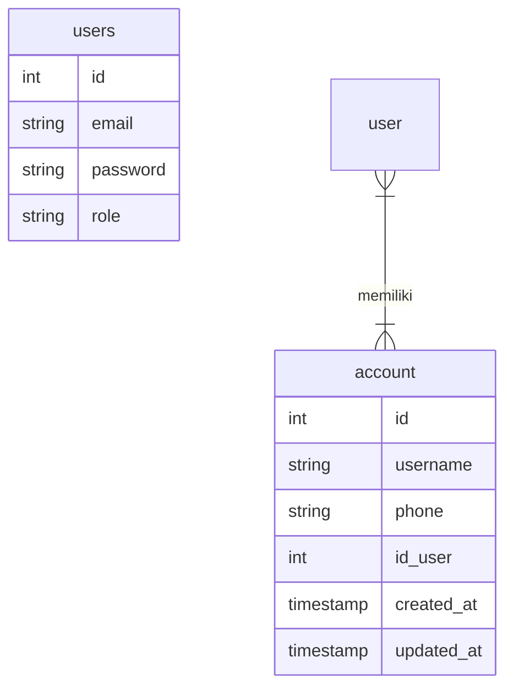

### ERD AUTHENTICATION FLOW

```mermaid
erDiagram

users {
    int id
    string email
    string password
    string role
}

account {
    int id
    string username
    string phone
    int id_user
    timestamp created_at
    timestamp updated_at
}

user }|--|{ account : memiliki


```