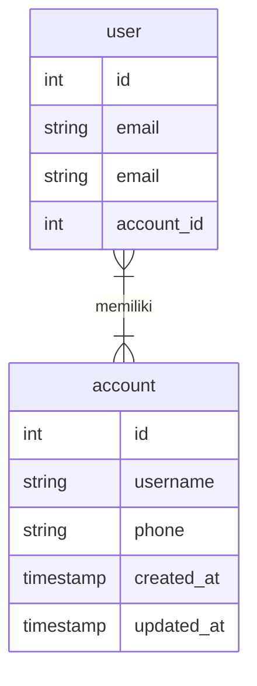

### ERD AUTHENTICATION FLOW

```mermaid
erDiagram

user {
    int id
    string email
    string email
    int account_id
}

account {
    int id
    string username
    string phone
    timestamp created_at
    timestamp updated_at
}

user }|--|{ account : memiliki


```